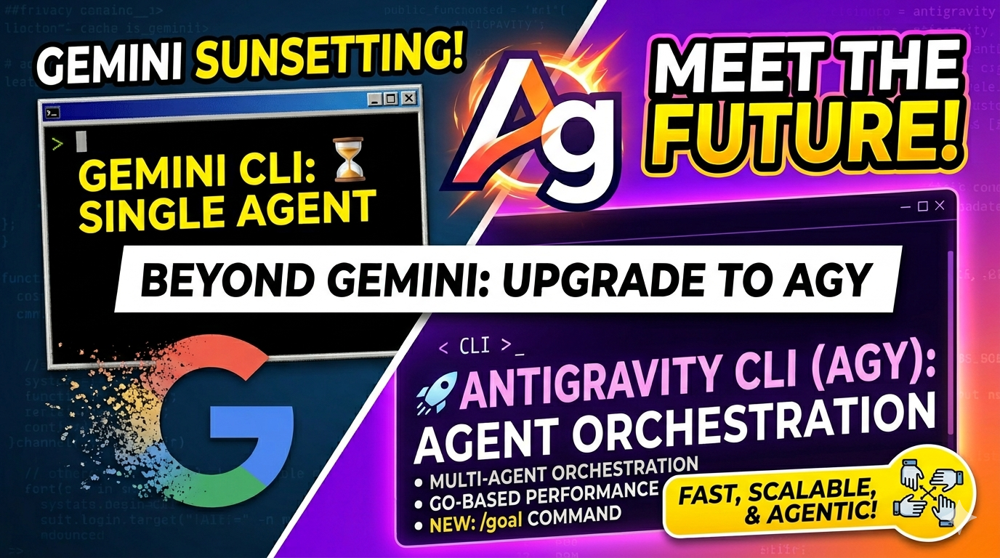

## Introduction: Are You Ready for the Next Leap in AI Orchestration?
The world of command-line AI is evolving faster than ever. For years, Gemini CLI has been our faithful companion, turning complex tasks into simple commands. But what if you could do more than just talk to one agent? What if you could orchestrate a symphony of specialized agents working in parallel to solve your most complex problems? Enter **Antigravity CLI (agy)**—the official successor to Gemini CLI. Are you ready to migrate?

## Key Highlights: Why Antigravity is a Game Changer
1. **Parallel Multi-Agent Orchestration**: Unlike Gemini's single-agent approach, Antigravity can spin up multiple subagents simultaneously to tackle different parts of a project at once.
2. **Go-Based Performance**: Rewritten in Go, the new CLI offers near-instant startup times and significantly lower resource overhead compared to the Node.js-based Gemini CLI.
3. **Advanced Workflow Commands**: New capabilities like `/goal` for complex task management and `/schedule` for recurring agentic workflows redefine what's possible in a terminal.

## Deep Dive: The Transition from Gemini to Antigravity

### 1. From Reactive to Orchestrated: The Multi-Agent Power
Gemini CLI operates on a reactive, single-agent model. You ask, it answers. Antigravity CLI introduces **Parallel Subagents**. Imagine you are building a new feature. With Antigravity, you can use the `/goal` command:

> `agy /goal "Implement a new authentication module with tests and documentation"`

Behind the scenes, Antigravity spins up three subagents: one to write the code, one to draft the tests, and one to generate documentation. They work in parallel, communicating via a shared context, and deliver the result in a fraction of the time.

### 2. Speed and Efficiency: The Go Advantage
One of the most immediate changes you'll notice is speed. Gemini CLI, being Node.js-based, has a slight delay during startup. Antigravity is a compiled Go binary. This means:

- **Instant Start**: No more waiting for the Node runtime to initialize.
- **Lower Memory Footprint**: Better efficiency when running long-lived background tasks.
- **Simplified Distribution**: A single binary that works across systems without worrying about Node versions.

### 3. A Seamless Migration Path
Google has made the transition as painless as possible. You don't have to start from scratch.

- **Importing Plugins**: Use `agy plugin import gemini` to bring your favorite extensions over.
- **Config Compatibility**: Your existing `GEMINI.md` and `AGENTS.md` files are fully supported.
- **The "Doctor" Tool**: Run `agy doctor` to verify your environment and get tips on optimizing your setup for the new platform.

## Conclusion: The Road Ahead
The sunsetting of Gemini CLI on June 18, 2026, isn't just an end; it's a beginning. Antigravity CLI represents a shift toward more autonomous, efficient, and powerful AI interactions. By moving to `agy`, you're not just changing a command; you're upgrading your entire development workflow to be more asynchronous and agent-centric. The future of the CLI is here, and it’s weightless.

## References
- [Google Official Announcement - Antigravity CLI](https://getbind.co)
- [Migrating to Antigravity 2.0 - Medium](https://medium.com)
- [Antigravity vs Gemini: Technical Deep Dive - Virtualization Review](https://virtualizationreview.com)
- [Antigravity CLI Walkthrough - YouTube](https://youtube.com)
